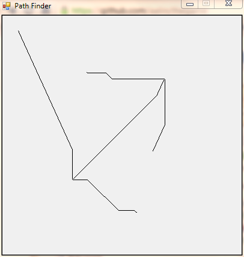

# Introduction

🔥 Latest news

- fixed A* inner loop performance (thanks [amitp](https://www.redblobgames.com/pathfinding/a-star/implementation.html)!)

This is an implementation of the
[A*](http://en.wikipedia.org/wiki/A*_search_algorithm) search algorithm. Click
twice in the program window and the points will be connected with a line that
doesn't cross any of the previous lines.

## Screenshot

## Implementation

The implementation is pretty much the Wikipedia version. I am using the C5
library because it has a nice priority queue. Tests of the algorithm itself have
been made using [NUnit](http://www.nunit.org/).

The visualization is done with Windows Forms so you'll need to compile this
using .NET Framework on Windows.

> Daniel Lidström
